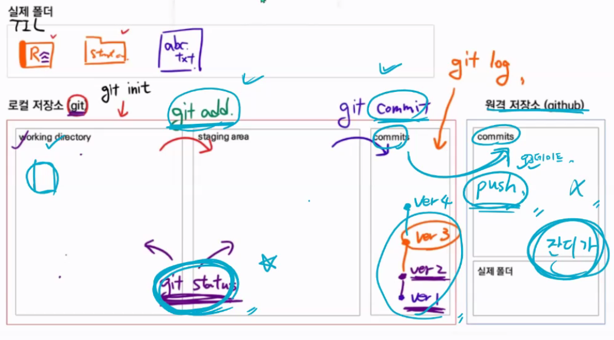

# Git & Git hub 기초

---

## Git : 분산 버전 관리 프로그램

---

## 구조

---

### git의 기본적인 구조




---

### 로컬 저장소 (git)

+ Working Directory 

+ Staging Area (확인, 검수)

+ Commits (Local repositories)

### 원격 저장소 (github) 

+ Commits
+ 실제 폴더 

---

### Git 명령어 

```
$ git status : git 상태 확인 (working directory와 staging area) *
$ git log : git 버전 변경 정보 확인

$ git init : git에 처음으로 working directory 폴더를 활성화 *
$ git add : working directory -> staging area 이동하여 tracked 상태가 되어 관리대상파일로 변경됨
$ git add . : 현재 디렉토리의 파일 전부 이동 *
$ git commit : staging area -> commits 이동 (version 생성)
$ git commit -m " " : 이유까지 같이 이동 *
$ git push : 원격저장소인 github로 이동 *
$ git push origin master : git push -u origin master를 하지 않았을 경우

```

### Git 상태

#### git status

+ **untracked** : Working Directory 에 있어 처음으로 관리되는 대상 (Staging Area에 올라가기전)(빨간색)

+ **tracked** : Staging Area에서 관리되고 있는 대상
  + 관리되고 있는 대상의 내용이 변경되면  modified로 표시됨 (녹색) 
  + 새로 만들어진 대상이라면 untracked로 표시됨(빨간색)
+ **git commit** 후 이유 작성 필수
  + 편집창 열리면 i(인서트) 클릭 후 이유 입력
  + esc키 누르고 : wq 로 빠져나오기
  + 빠른 입력은 git commit -m '메시지 입력'

---

### git push (원격 저장소 git hub로 추가)

* 원격 저장소 정보등록 (url)

  git remote add remote별명 remote주소  (주로 사용하는 remote 별명은 origin)

  ```
  git remote add origin https://github.com/ict-cspark/TIL.git
  ```

* 로컬 내용을 push 한다

  ```
  git push -u origin master
  ```

  이후에는 git push 만으로도 사용 가능

* git hub - repository에 잘 업로드 되었는지 확인