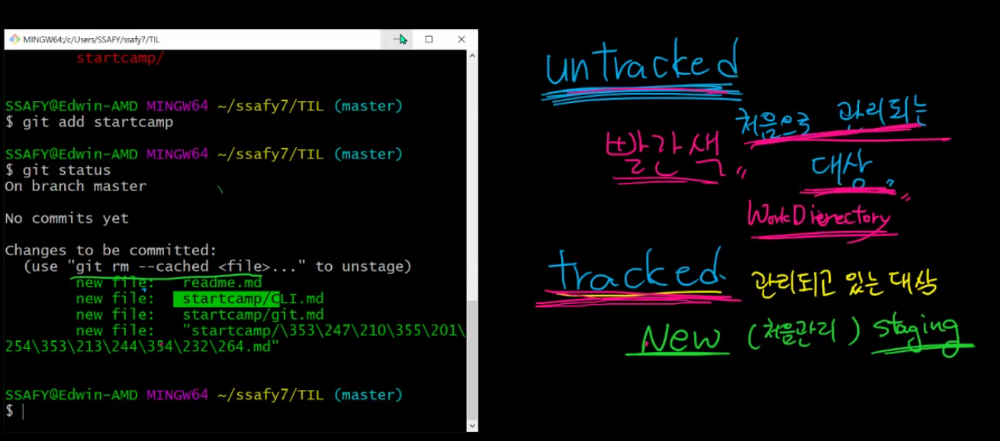

# Git & Git hub 기초

---

## Git : 분산 버전 관리 프로그램

---

## 구조

---

### git의 기본적인 구조




---

##### 로컬 저장소 (git)

+ Working Directory 

+ Staging Area (확인, 검수)

+ Commits (Local repositories)

##### 원격 저장소 (github) 

+ Commits
+ 실제 폴더 

---

#### Git 명령어 

```
$ git status : git 상태 확인 (working directory와 staging area)
$ git log : git 버전 변경 정보 확인

$ git init : git에 처음 폴더를 활성화
$ git add : working directory -> staging area 이동
$ git add . : 현재 디렉토리의 파일 전부 이동
$ git commit : staging area -> commits 이동 (version 생성)
$ git commit -m " " : 이유까지 같이 이동
$ git push : 

```

#### Git 상태

##### $ git status

+ untracked : Working Directory 에 있어 처음으로 관리되는 대상 (빨간색)(Staging Area에 올라가기전)

+ tracked : Staging Area에서 관리되고 있는 대상
  + New (처음관리) Staging Area, modified (녹색)
  +  unmodified
+ git commit 후 이유 작성 필수
  + 편집창 열리면 i(인서트) 클릭 후 이유 입력
  + esc키 누르고 : wq 로 빠져나오기
  + 빠른 입력은 git commit -m '메시지 입력'

##### $ git push

* 원격 저장소 정보등록 (url)

  * git remote add origin(컨벤션) remote별명 remote주소

    ```
    git remote add origin https://github.com/ict-cspark/TIL.git

* 로컬 내용을 push 한다

  ```
  git push -u origin master